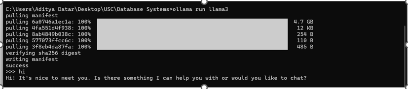
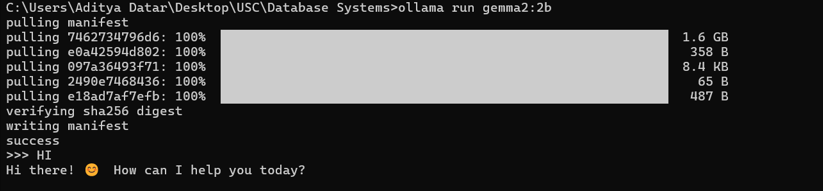
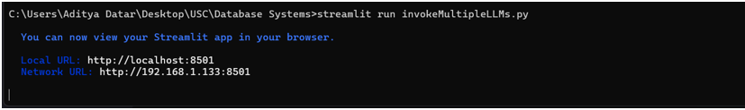
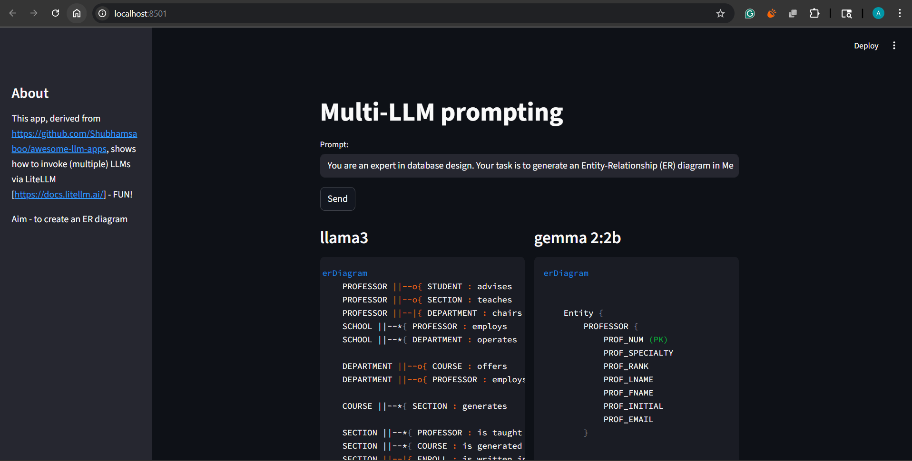
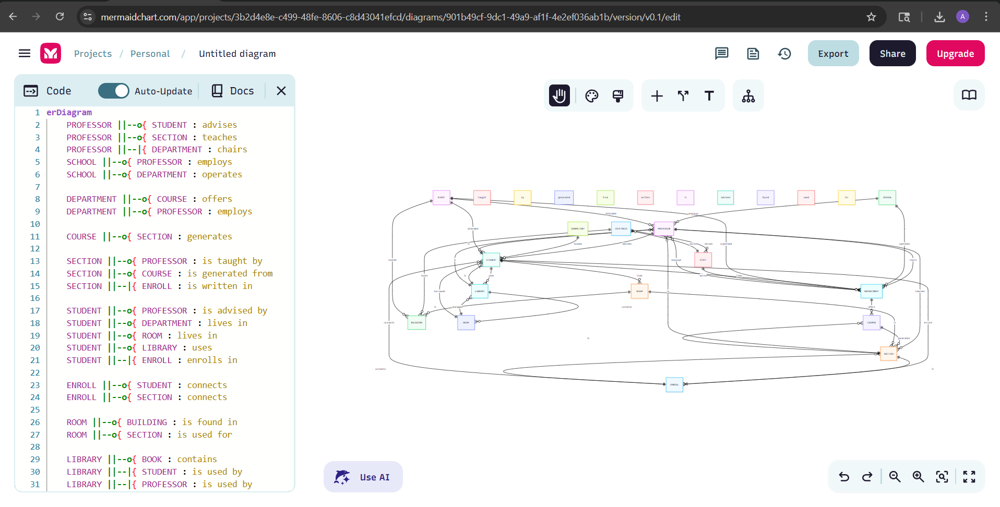

# DrawMyDB

This project demonstrates how Large Language Models (LLMs) can be used to generate an **Entity-Relationship (ER) Diagram** for the core operations of a small college.  
Instead of manually designing the ER diagram, we prompted LLMs (Llama3 and Gemma2) locally using Ollama to create entities, attributes, and relationships in **Mermaid format**, and then rendered the diagram.

---

## 🚀 Steps Followed

### 1. Installed the LLMs
- Installed and set up **Llama3** and **Gemma2:2b** for experimentation.
- Verified model installation and readiness.  

📸 *Screenshot of the two LLMs installed:*  

---

### 2. Saved the Prompt & Ran the Code
- Created a prompt that describes entities and relationships for the college database.  
- Ran the models and collected their outputs in Mermaid syntax.  

📸 *Screenshot of running the code:*  

---

### 3. Observations on the Hallucinations in Models
- When left to **think freely**, both models often **hallucinated**:
  - Incorrect attributes
  - Broken Mermaid syntax
  - Missing relationships between entities
- This required multiple retries and adjustments. 

📸 *Screenshot of imperfect prompt*  

📸 *Screenshot of imperfect prompt and hallucinated output:*  

---

### 4. Spoon-Fed Prompt = Accurate Results
- By providing the model with a **step-by-step, spoon-fed prompt**, accuracy improved drastically.
- Final output was a **well-connected ER diagram** with 15 entities (9 academic + 6 extended campus life entities).  

📸 *Screenshot of the final ER diagram:*  
  

📸 *Screenshot of the final spoon-fed prompt:*  

---

## ✅ Key Learnings
- LLMs can generate **database design diagrams** effectively if guided carefully.  
- Free-form prompting → **Hallucinations**  
- Structured, detailed prompts → **Correct, connected ER diagrams**  

---

## 🖼️ Final ER Diagram (Rendered via Mermaid)

